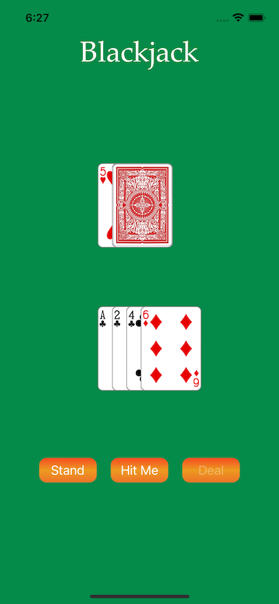
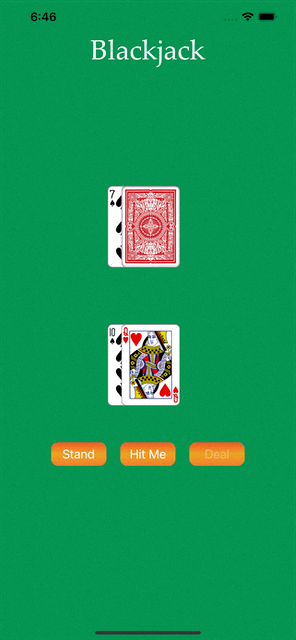

# Blackjack

Blackjack is an iOS app written in Swift that implements a basic game of blackjack. It targets iOS 13 but I don't think there is any reason it couldn't be made to target a lower version if you create an older Xcode project (without scenes). It uses UIKit and implements the UI programmatically other than the default initial setup.

## License

Blackjack is licensed under the Unlicense. See the LICENSE file for more information, but basically this is sample code and you can do whatever you want with it.
